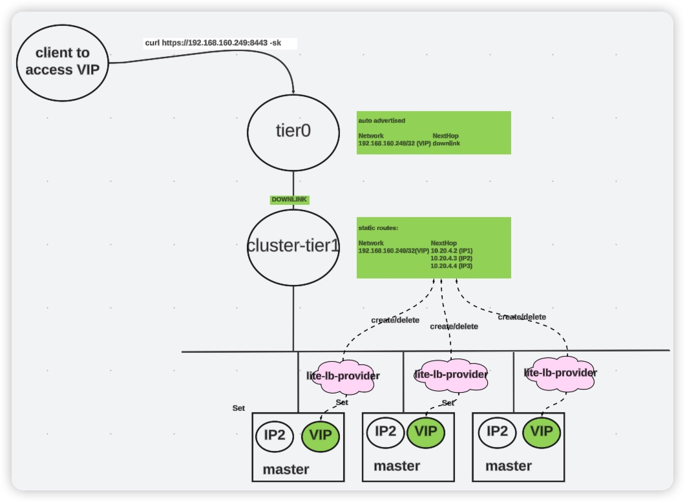

# kubernetes control plane lite LB based on NSX-T


This is a lite kubernetes control plane LB solution. Typically, workload LB requires rich features to support production. However, control plane LB usually can be simple. It is able to satisfy basic load balancing or high availability necessity if traffic can be just directed to different control planes.

In NSX-T/vSphere environment, kubernetes cluster can be deployed in a NSX-T segment that is a downlink of a tier1 gateway. It is quite common scenario and topology, especially for clusters using NSX Container Plugin (NCP) CNI. 

The idea is deploying a controller running on each control plane. This controller will:
- set VIP to lo interface for current control plane vm
- watch kubernetes endpointslice, and use the endpoints within it to dynamically maintain a static route (Network: VIP, NextHops: all the endpoints) on cluster tier1

This VIP network will be auto advertised to tier0 gateway, and then relayed to the external network. Therefore, API request to that VIP will be directly to 3 masters with some probability, based on the static route.




This repository is a POC for this idea. A full demo please see [demo](https://github.com/wyike/nsxt-lite-lb-provider/tree/main/docs/experiment.md)


## Usage:

```
./nsxt-lite-lb-provider-linux-amd64-1728910362 -h
Usage of ./nsxt-lite-lb-provider-linux-amd64-1728910362:
  -clusterrouterid string
        tier1 policy id, that controller plane vms are connected to (default "pks-a898fb55-f7dc-4e8e-b4ea-c9eb1d08a46a-cluster-router")
  -clustervip string
        cluster controlplane VIP, that is defined by user (default "10.10.10.1")
  -kubeconfig string
        Paths to a kubeconfig. Only required if out-of-cluster.
  -nsxhost string
        nsx host name, please provide with scheme like: https://nsxhost (default "https://nsxhost")
  -nsxpassword string
        nsx password (default "prettycoco")
  -nsxuser string
        nsx user name (default "admin")
  -setvipenabled
        vip configuration on control plane is enabled or not. It requires privilege to run system command on VM (default true)
```

