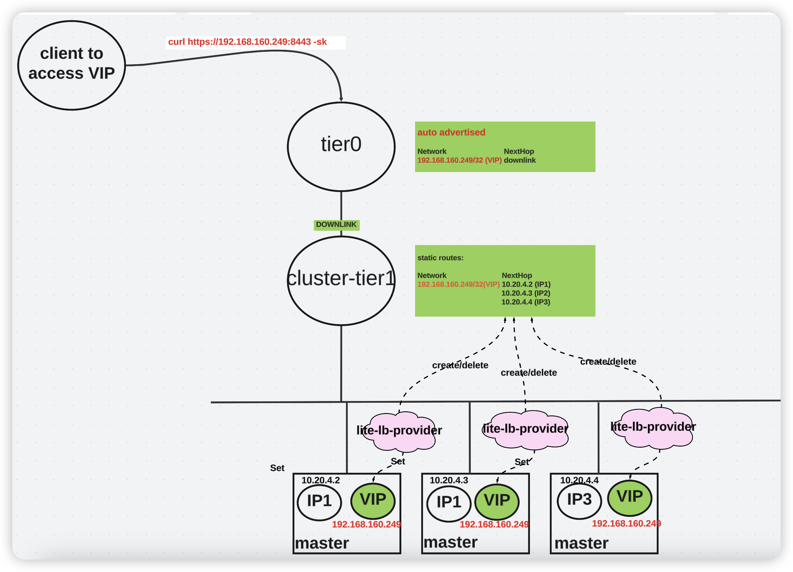

# kubernetes control plane lite LB based on NSX-T


This is a lite kubernetes control plane LB solution. Typically, workload LB requires rich features to support production. However, control plane LB usually can be simple. It is able to satisfy basic load balancing or high availability necessity if traffic can be just directed to different control planes.

In NSX-T/vSphere environment, kubernetes cluster can be deployed in a NSX-T segment that is a downlink of a tier1 gateway. It is quite common scenario and topology, especially for clusters using NSX Container Plugin (NCP) CNI. 

The idea is deploying a controller running on each control plane. This controller will:
- set VIP to lo interface for current control plane vm
- watch kubernetes endpointslice, and use the endpoints within it to dynamically maintain a static route (Network: VIP, NextHops: all the endpoints) on cluster tier1

This VIP network will be auto advertised to tier0 gateway, and then relayed to the external network. Therefore, API request to that VIP will be directly to 3 masters with some probability, based on the static route.




This repository is a POC for this idea.

In the Experiment, I deploy the controller with binary on all masters:
- master1 
```
master/3c837bc5-74b3-44ef-bd91-9e78570d0584:# ./nsxt-lite-lb-provider-linux-amd64-1728888626 --kubeconfig=kubeconfig  --nsxhost https://<my nsx> --nsxuser admin  --clustervip 192.168.160.249 --clusterrouterid pks-c1c8cd60-37ff-4d32-8237-d50f1eb49c7a-cluster-router
2024-10-14T08:57:23Z    INFO    starting nsxt lite lb controller manager
2024-10-14T08:57:23Z    INFO    controller-runtime.metrics      Starting metrics server
I1014 08:57:23.325291   19373 leaderelection.go:254] attempting to acquire leader lease default/nsxt-lite-lb-controller-leader-election...
2024-10-14T08:57:23Z    INFO    controller-runtime.metrics      Serving metrics server  {"bindAddress": ":8080", "secure": false}
2024-10-14T08:57:39Z    DEBUG   events  ff6c40ac-4768-4fc0-be1a-be0ecad8402c_b6e74aec-e81a-4dcb-85b0-2083fe897984 became leader {"type": "Normal", "object": {"kind":"Lease","namespace":"default","name":"nsxt-lite-lb-controller-leader-election","uid":"b2c61d7d-8b5b-4bf0-a8e7-6ec404ae3565","apiVersion":"coordination.k8s.io/v1","resourceVersion":"22231"}, "reason": "LeaderElection"}
I1014 08:57:39.942161   19373 leaderelection.go:268] successfully acquired lease default/nsxt-lite-lb-controller-leader-election
2024-10-14T08:57:39Z    INFO    Starting EventSource    {"controller": "endpointslice", "controllerGroup": "discovery.k8s.io", "controllerKind": "EndpointSlice", "source": "kind source: *v1.EndpointSlice"}
2024-10-14T08:57:39Z    INFO    Starting Controller     {"controller": "endpointslice", "controllerGroup": "discovery.k8s.io", "controllerKind": "EndpointSlice"}
2024-10-14T08:57:40Z    INFO    Starting workers        {"controller": "endpointslice", "controllerGroup": "discovery.k8s.io", "controllerKind": "EndpointSlice", "worker count": 1}
2024-10-14T08:57:40Z    INFO    setup.endpointSliceReconciler   processing EndpointSlice        {"name": "kubernetes", "endpoints": ["10.20.4.2", "10.20.4.3", "10.20.4.4"]}
2024-10-14T08:57:40Z    INFO    setup.nsxt      static route is created {"name": "to-192.168.160.249", "hops": [{"admin_distance":1,"ip_address":"10.20.4.2"},{"admin_distance":1,"ip_address":"10.20.4.3"},{"admin_distance":1,"ip_address":"10.20.4.4"}]}
```
- master2 
```
master/957cd3e7-db83-4948-9e29-083d526fac1e:# ./nsxt-lite-lb-provider-linux-amd64-1728888626 --kubeconfig=kubeconfig  --nsxhost https://<my nsx> --nsxuser admin  --clustervip 192.168.160.249 --clusterrouterid pks-c1c8cd60-37ff-4d32-8237-d50f1eb49c7a-cluster-router
2024-10-14T08:59:30Z    INFO    starting nsxt lite lb controller manager
2024-10-14T08:59:30Z    INFO    controller-runtime.metrics      Starting metrics server
I1014 08:59:30.822159   17123 leaderelection.go:254] attempting to acquire leader lease default/nsxt-lite-lb-controller-leader-election...
2024-10-14T08:59:30Z    INFO    controller-runtime.metrics      Serving metrics server  {"bindAddress": ":8080", "secure": false}
```
- master3 
```
master/246f8315-d3ef-4a07-8977-dea080df6c27:# ./nsxt-lite-lb-provider-linux-amd64-1728888626 --kubeconfig=kubeconfig  --nsxhost https://<my nsx> --nsxuser admin  --clustervip 192.168.160.249 --clusterrouterid pks-c1c8cd60-37ff-4d32-8237-d50f1eb49c7a-cluster-router
2024-10-14T08:59:46Z    INFO    starting nsxt lite lb controller manager
2024-10-14T08:59:46Z    INFO    controller-runtime.metrics      Starting metrics server
I1014 08:59:46.335624   16986 leaderelection.go:254] attempting to acquire leader lease default/nsxt-lite-lb-controller-leader-election...
2024-10-14T08:59:46Z    INFO    controller-runtime.metrics      Serving metrics server  {"bindAddress": ":8080", "secure": false}
```

Delete one master vm manually, the controller leader changes to master2 from master1. The next hops to VIP decrease to 2. After a while, new master vm is created and next hops to VIP increases to 3 masters.

```
master/957cd3e7-db83-4948-9e29-083d526fac1e:# ./nsxt-lite-lb-provider-linux-amd64-1728888626 --kubeconfig=kubeconfig  --nsxhost https://<my nsx> --nsxuser admin  --clustervip 192.168.160.249 --clusterrouterid pks-c1c8cd60-37ff-4d32-8237-d50f1eb49c7a-cluster-router
2024-10-14T08:59:30Z    INFO    starting nsxt lite lb controller manager
2024-10-14T08:59:30Z    INFO    controller-runtime.metrics      Starting metrics server
I1014 08:59:30.822159   17123 leaderelection.go:254] attempting to acquire leader lease default/nsxt-lite-lb-controller-leader-election...
2024-10-14T08:59:30Z    INFO    controller-runtime.metrics      Serving metrics server  {"bindAddress": ":8080", "secure": false}
E1014 09:01:10.311142   17123 leaderelection.go:436] error retrieving resource lock default/nsxt-lite-lb-controller-leader-election: rpc error: code = Unavailable desc = error reading from server: read tcp 10.20.4.2:60860->10.20.4.3:2379: read: connection timed out
2024-10-14T09:01:31Z    DEBUG   events  b963c5a4-1b96-44b3-b7aa-87165b7ec8b1_7d6c0449-3e9e-43b0-9c89-218381703f58 became leader {"type": "Normal", "object": {"kind":"Lease","namespace":"default","name":"nsxt-lite-lb-controller-leader-election","uid":"b2c61d7d-8b5b-4bf0-a8e7-6ec404ae3565","apiVersion":"coordination.k8s.io/v1","resourceVersion":"23251"}, "reason": "LeaderElection"}
I1014 09:01:31.075269   17123 leaderelection.go:268] successfully acquired lease default/nsxt-lite-lb-controller-leader-election
2024-10-14T09:01:31Z    INFO    Starting EventSource    {"controller": "endpointslice", "controllerGroup": "discovery.k8s.io", "controllerKind": "EndpointSlice", "source": "kind source: *v1.EndpointSlice"}
2024-10-14T09:01:31Z    INFO    Starting Controller     {"controller": "endpointslice", "controllerGroup": "discovery.k8s.io", "controllerKind": "EndpointSlice"}
2024-10-14T09:01:31Z    INFO    Starting workers        {"controller": "endpointslice", "controllerGroup": "discovery.k8s.io", "controllerKind": "EndpointSlice", "worker count": 1}
2024-10-14T09:01:31Z    INFO    setup.endpointSliceReconciler   processing EndpointSlice        {"name": "kubernetes", "endpoints": ["10.20.4.2", "10.20.4.4"]}
2024-10-14T09:01:31Z    INFO    setup.nsxt      static route is created {"name": "to-192.168.160.249", "hops": [{"admin_distance":1,"ip_address":"10.20.4.2"},{"admin_distance":1,"ip_address":"10.20.4.4"}]}
2024-10-14T09:04:28Z    INFO    setup.endpointSliceReconciler   processing EndpointSlice        {"name": "kubernetes", "endpoints": ["10.20.4.2", "10.20.4.3", "10.20.4.4"]}
2024-10-14T09:04:28Z    INFO    setup.nsxt      static route is created {"name": "to-192.168.160.249", "hops": [{"admin_distance":1,"ip_address":"10.20.4.2"},{"admin_distance":1,"ip_address":"10.20.4.3"},{"admin_distance":1,"ip_address":"10.20.4.4"}]}
```

API request to VIP 192.168.160.249 will be directly to 3 masters with some probability per the static route. I can capture packets from the client on all masters.

```
curl https://192.168.160.249:8443 -sk
{
  "kind": "Status",
  "apiVersion": "v1",
  "metadata": {},
  "status": "Failure",
  "message": "forbidden: User \"system:anonymous\" cannot get path \"/\"",
  "reason": "Forbidden",
  "details": {},
  "code": 403
}
```


The Looks of static route on tier1 gateway for the cluster control plane VIP network:


##### TODO: 
1. add daemonset deployment support
2. cleanup workflow, it should vary per different cluster provisioner