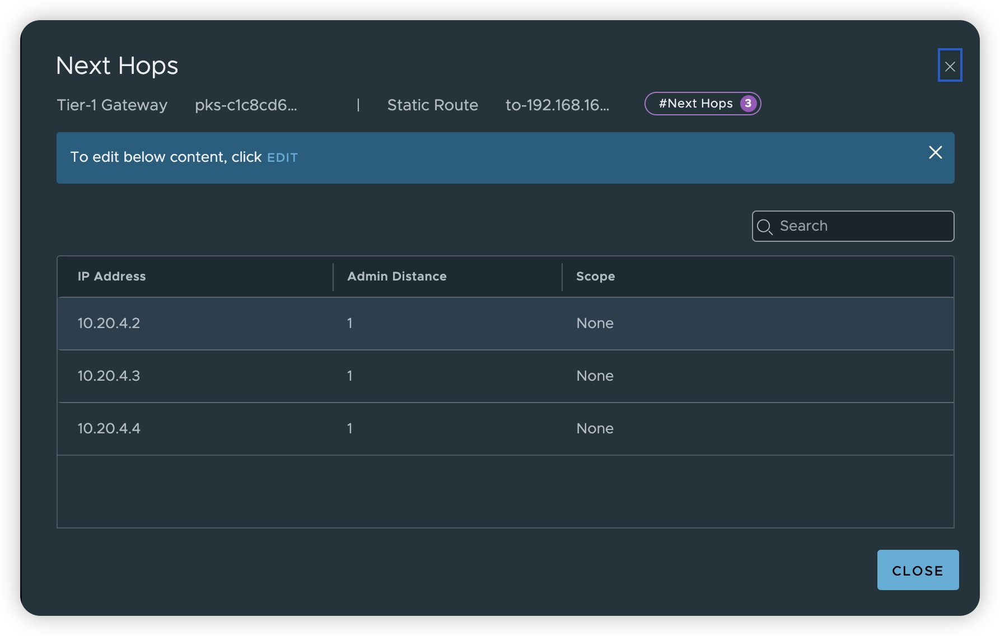

In the Experiment, I deploy the controller with binary on all masters:
- master1
```
master/3c837bc5-74b3-44ef-bd91-9e78570d0584:# ./nsxt-lite-lb-provider-linux-amd64-1728888626 --kubeconfig=kubeconfig  --nsxhost https://<my nsx> --nsxuser admin  --clustervip 192.168.160.249 --clusterrouterid pks-c1c8cd60-37ff-4d32-8237-d50f1eb49c7a-cluster-router
2024-10-14T08:57:23Z    INFO    starting nsxt lite lb controller manager
2024-10-14T08:57:23Z    INFO    controller-runtime.metrics      Starting metrics server
I1014 08:57:23.325291   19373 leaderelection.go:254] attempting to acquire leader lease default/nsxt-lite-lb-controller-leader-election...
2024-10-14T08:57:23Z    INFO    controller-runtime.metrics      Serving metrics server  {"bindAddress": ":8080", "secure": false}
2024-10-14T08:57:39Z    DEBUG   events  ff6c40ac-4768-4fc0-be1a-be0ecad8402c_b6e74aec-e81a-4dcb-85b0-2083fe897984 became leader {"type": "Normal", "object": {"kind":"Lease","namespace":"default","name":"nsxt-lite-lb-controller-leader-election","uid":"b2c61d7d-8b5b-4bf0-a8e7-6ec404ae3565","apiVersion":"coordination.k8s.io/v1","resourceVersion":"22231"}, "reason": "LeaderElection"}
I1014 08:57:39.942161   19373 leaderelection.go:268] successfully acquired lease default/nsxt-lite-lb-controller-leader-election
2024-10-14T08:57:39Z    INFO    Starting EventSource    {"controller": "endpointslice", "controllerGroup": "discovery.k8s.io", "controllerKind": "EndpointSlice", "source": "kind source: *v1.EndpointSlice"}
2024-10-14T08:57:39Z    INFO    Starting Controller     {"controller": "endpointslice", "controllerGroup": "discovery.k8s.io", "controllerKind": "EndpointSlice"}
2024-10-14T08:57:40Z    INFO    Starting workers        {"controller": "endpointslice", "controllerGroup": "discovery.k8s.io", "controllerKind": "EndpointSlice", "worker count": 1}
2024-10-14T08:57:40Z    INFO    setup.endpointSliceReconciler   processing EndpointSlice        {"name": "kubernetes", "endpoints": ["10.20.4.2", "10.20.4.3", "10.20.4.4"]}
2024-10-14T08:57:40Z    INFO    setup.nsxt      static route is created {"name": "to-192.168.160.249", "hops": [{"admin_distance":1,"ip_address":"10.20.4.2"},{"admin_distance":1,"ip_address":"10.20.4.3"},{"admin_distance":1,"ip_address":"10.20.4.4"}]}
```
- master2
```
master/957cd3e7-db83-4948-9e29-083d526fac1e:# ./nsxt-lite-lb-provider-linux-amd64-1728888626 --kubeconfig=kubeconfig  --nsxhost https://<my nsx> --nsxuser admin  --clustervip 192.168.160.249 --clusterrouterid pks-c1c8cd60-37ff-4d32-8237-d50f1eb49c7a-cluster-router
2024-10-14T08:59:30Z    INFO    starting nsxt lite lb controller manager
2024-10-14T08:59:30Z    INFO    controller-runtime.metrics      Starting metrics server
I1014 08:59:30.822159   17123 leaderelection.go:254] attempting to acquire leader lease default/nsxt-lite-lb-controller-leader-election...
2024-10-14T08:59:30Z    INFO    controller-runtime.metrics      Serving metrics server  {"bindAddress": ":8080", "secure": false}
```
- master3
```
master/246f8315-d3ef-4a07-8977-dea080df6c27:# ./nsxt-lite-lb-provider-linux-amd64-1728888626 --kubeconfig=kubeconfig  --nsxhost https://<my nsx> --nsxuser admin  --clustervip 192.168.160.249 --clusterrouterid pks-c1c8cd60-37ff-4d32-8237-d50f1eb49c7a-cluster-router
2024-10-14T08:59:46Z    INFO    starting nsxt lite lb controller manager
2024-10-14T08:59:46Z    INFO    controller-runtime.metrics      Starting metrics server
I1014 08:59:46.335624   16986 leaderelection.go:254] attempting to acquire leader lease default/nsxt-lite-lb-controller-leader-election...
2024-10-14T08:59:46Z    INFO    controller-runtime.metrics      Serving metrics server  {"bindAddress": ":8080", "secure": false}
```

Delete one master vm manually, the controller leader changes to master2 from master1. The next hops to VIP decrease to 2. After a while, new master vm is created and next hops to VIP increases to 3 masters.

```
master/957cd3e7-db83-4948-9e29-083d526fac1e:# ./nsxt-lite-lb-provider-linux-amd64-1728888626 --kubeconfig=kubeconfig  --nsxhost https://<my nsx> --nsxuser admin  --clustervip 192.168.160.249 --clusterrouterid pks-c1c8cd60-37ff-4d32-8237-d50f1eb49c7a-cluster-router
2024-10-14T08:59:30Z    INFO    starting nsxt lite lb controller manager
2024-10-14T08:59:30Z    INFO    controller-runtime.metrics      Starting metrics server
I1014 08:59:30.822159   17123 leaderelection.go:254] attempting to acquire leader lease default/nsxt-lite-lb-controller-leader-election...
2024-10-14T08:59:30Z    INFO    controller-runtime.metrics      Serving metrics server  {"bindAddress": ":8080", "secure": false}
E1014 09:01:10.311142   17123 leaderelection.go:436] error retrieving resource lock default/nsxt-lite-lb-controller-leader-election: rpc error: code = Unavailable desc = error reading from server: read tcp 10.20.4.2:60860->10.20.4.3:2379: read: connection timed out
2024-10-14T09:01:31Z    DEBUG   events  b963c5a4-1b96-44b3-b7aa-87165b7ec8b1_7d6c0449-3e9e-43b0-9c89-218381703f58 became leader {"type": "Normal", "object": {"kind":"Lease","namespace":"default","name":"nsxt-lite-lb-controller-leader-election","uid":"b2c61d7d-8b5b-4bf0-a8e7-6ec404ae3565","apiVersion":"coordination.k8s.io/v1","resourceVersion":"23251"}, "reason": "LeaderElection"}
I1014 09:01:31.075269   17123 leaderelection.go:268] successfully acquired lease default/nsxt-lite-lb-controller-leader-election
2024-10-14T09:01:31Z    INFO    Starting EventSource    {"controller": "endpointslice", "controllerGroup": "discovery.k8s.io", "controllerKind": "EndpointSlice", "source": "kind source: *v1.EndpointSlice"}
2024-10-14T09:01:31Z    INFO    Starting Controller     {"controller": "endpointslice", "controllerGroup": "discovery.k8s.io", "controllerKind": "EndpointSlice"}
2024-10-14T09:01:31Z    INFO    Starting workers        {"controller": "endpointslice", "controllerGroup": "discovery.k8s.io", "controllerKind": "EndpointSlice", "worker count": 1}
2024-10-14T09:01:31Z    INFO    setup.endpointSliceReconciler   processing EndpointSlice        {"name": "kubernetes", "endpoints": ["10.20.4.2", "10.20.4.4"]}
2024-10-14T09:01:31Z    INFO    setup.nsxt      static route is created {"name": "to-192.168.160.249", "hops": [{"admin_distance":1,"ip_address":"10.20.4.2"},{"admin_distance":1,"ip_address":"10.20.4.4"}]}
2024-10-14T09:04:28Z    INFO    setup.endpointSliceReconciler   processing EndpointSlice        {"name": "kubernetes", "endpoints": ["10.20.4.2", "10.20.4.3", "10.20.4.4"]}
2024-10-14T09:04:28Z    INFO    setup.nsxt      static route is created {"name": "to-192.168.160.249", "hops": [{"admin_distance":1,"ip_address":"10.20.4.2"},{"admin_distance":1,"ip_address":"10.20.4.3"},{"admin_distance":1,"ip_address":"10.20.4.4"}]}
```

API request to VIP 192.168.160.249 will be directly to 3 masters with some probability per the static route. I can capture packets from the client on all masters.

```
curl https://192.168.160.249:8443 -sk
{
  "kind": "Status",
  "apiVersion": "v1",
  "metadata": {},
  "status": "Failure",
  "message": "forbidden: User \"system:anonymous\" cannot get path \"/\"",
  "reason": "Forbidden",
  "details": {},
  "code": 403
}
```


The Looks of static route on tier1 gateway for the cluster control plane VIP network:





##### TODO:
1. add daemonset deployment support
2. cleanup workflow, it should vary per different cluster provisioner